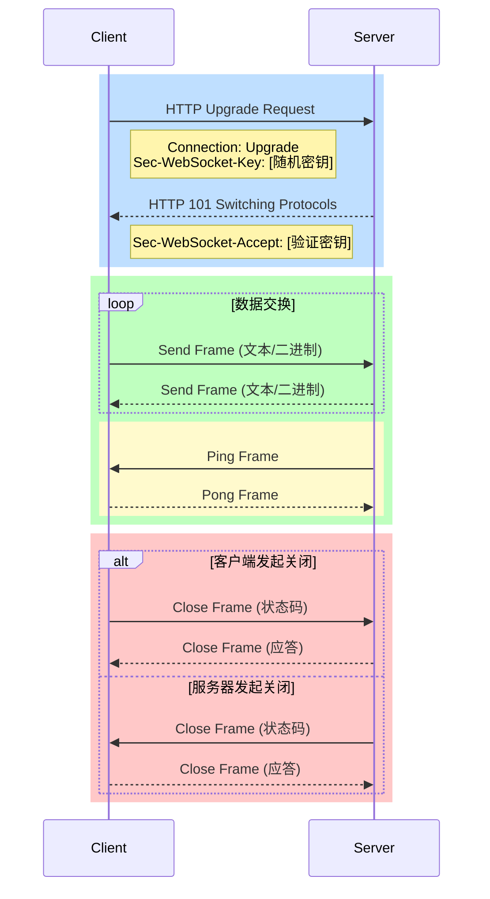
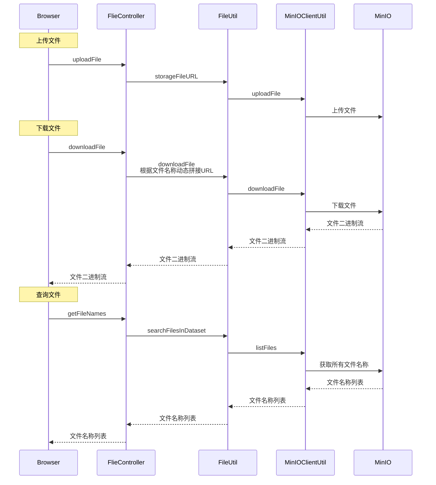

# 详细设计

## 聊天

参考资料

- [WebSocket 讲解](https://www.xiaolincoding.com/network/2_http/http_websocket.html#websocket%E6%8A%93%E5%8C%85)
- [Netty 入门](https://zhuanlan.zhihu.com/p/181239748)
- [WebSocket 的 6 种集成方式](https://juejin.cn/post/7111132777394733064)

### WebSocket

全双工通信的四种实现方式：不断轮询、长轮询、短轮询、WebSocket。

为什么使用 WebSocket？

- 前三者无论如何都会存在一定时间的"实时性盲区"，卡顿无法避免。

WebSocket 的数据包格式。

WebSocket 通信全流程：



### Netty

- Netty 分为服务端与客户端：`ServerBootstrap` `BootStrap`（客户端一般用不到）

- 服务端的两个线程组：

    - 为什么是两个线程组？与 Reactor 类似：[什么是 NIO 的 Reactor 模式](https://mp.weixin.qq.com/s/vWbbn1qXRFVva8Y9yET18Q)

    - ```java
        EventLoopGroup bossGroup = new NioEventLoopGroup();
        EventLoopGroup workerGroup = new NioEventLoopGroup();
        ```

### Netty集成WebSocket

自定义处理器，重写方法。

大致清楚了，Netty 将 HTTP 连接升级为 WebSocket 连接，通过继承重写方法，自定义 WebSocket 连接、请求、响应、结束的各个方法，实现聊天功能。

WebSocket 中有四个重写方法，分别是连接、接收消息、断开、异常

- 连接
    - 获取 `userId`
    - 将 `userId` 与 Channel 建立映射
- 接收消息
    - 接收到客户端发来的指定 Channel 的消息
    - 将消息存入数据库
    - （用户发 WebSocket 消息应当携带一个房间 ID，以便知道用户在哪个房间发消息。或者说前端传输更多的数据？）
    - 对于单聊：将消息发给房间中的另一人

### 聊天设计

消息管理

- 当用户在线时，服务端与用户维护一个 Channel 实时推送消息，并将消息存储至数据库。
- 当用户不在线时，仅将消息存储至数据库。

聊天框内容可分为三部分

- 历史对话。基于 HTTP 接口查询。
- 自己的实时消息。基于 WebSocket 发送。
- 别人的实时消息。基于 WebSocket 接收。

消息收发（WebSocket）

- 连接建立
    - AuthHandler 拦截握手阶段的 HTTP 请求，解析用户会话参数，将其设置为 Channel 的参数绑定。
    - 在内存中通过 HashMap 建立用户会话标识与 Channel 的映射。
- 消息收发
    - 类似 HTTP，约定参数格式，前后端收到消息后做相应处理。
    - 单聊：从 Channel 接收消息，通过用户会话标识找到接收人的 Channel，实时推送消息。
    - 群聊：从 Channel 接收消息，根据群聊房间 ID 给群聊中的所有 Channel（相当于群聊在线用户）实时推送消息。
- 连接断开
    - 删除会话标识与 Channel 的映射。

## 文件传输

使用 MinIO 进行对象存储。

为什么不用云服务商的对话存储？

- 都是调 API，从技术角度没什么区别。而且集成云服务商提供的 API 更麻烦些。



